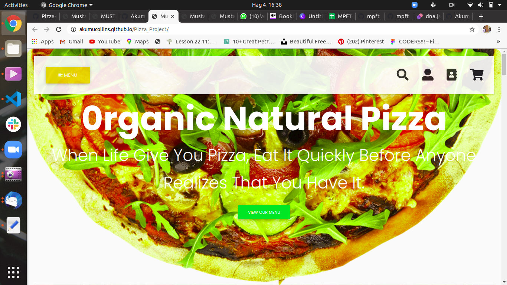

***

# Mustachio Pizzeria

#### **Tuesday AUGUST 4 2020** ;

***

#### By **Akumu Collins** ;

### Here is the **WebPage Screenshoot** ;

---

## Description
This is a web application for **Mustachio Pizzeria** which is a pizza selling venture, that shows details about the services and different pizza they sell, their menu and also allows customers to order online for their preferred pizza depending on size, crust and topping they need and also allows them to input a location which they would love the pizza to be delivered to.

***

## Setup/Installation Requirements
* get the project in github
* copy and  paste the clone link in your terimnal
* git clone https://github.com/Akumucollins/Pizza_Project.git to your local terminal
* cd to the project directory
* code . /atom . command  to open the text editor

---

## Technologies Used
* Html - For Building Mark Up pages
* css - For styling User Interface
* Jquery - For animations and cool effects of the website like hiding and showing elements
* Material Design Bootstrap -For making webpage responsive
* Mailchimp API -  For tracking all emails and messages from users input
* Bootstrap4 - For making webpage responsive
* Javascript - For document object manipulation

***
  
## Behaviour Driven Development
| Behaviour      | Input        | Output       |
| :------------- | :----------: | -----------: |
|  Select Pizza-Type | Margherita Pizza |   Margherita Pizza |
| Select Pizza-Size | small, Medium, Large |  Large |
| Select Pizza-Crust |  Either Cripsy,Stuffed or Gluten-Free |  Gluten-Free |
| select Pizza-Toppings |  Select the Checkbox of all the topppings you want | Mushrooms |
| Press Check Your Order button |   Select Self Pick-up  | Your Order is Ksh. |
| Press Check Your Order button |   Select On-Demand Delivery  | Your Order is Ksh.  plus a charge of ksh. 300 |
| Press Check Your Order button |   Select Scheduled  On-Demand Delivery  | Your Order is Ksh.  plus a cherge of Ksh. 500|

---

## Dependencies
* Mailchimp API
* Jquery
* Bootstrap

---

## Show Your Support
* Give  a thumbs up if this project is of aid to you !

***

## Contact details
Feel free to contact me @ akumucollins001@gmail.com  if there are any bugs. 

---

## License
The project is [MIT](LICENSE) licensed  

***